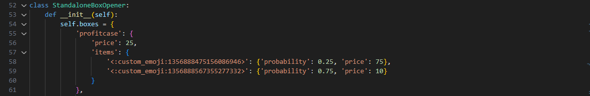
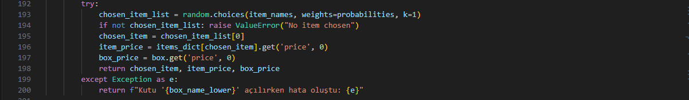
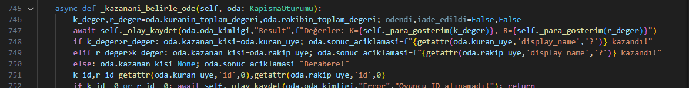
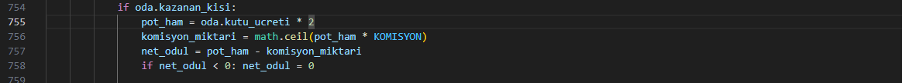
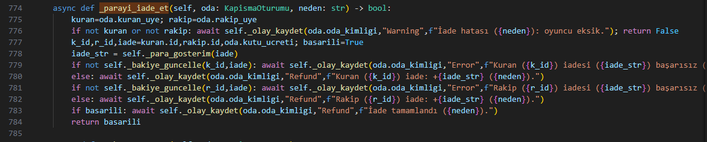
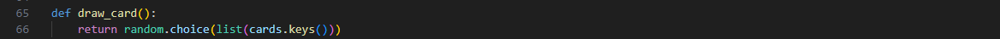
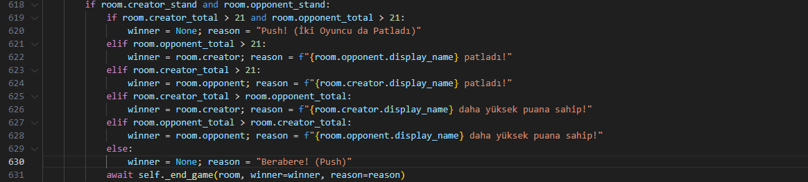
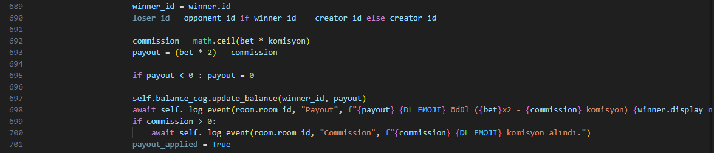
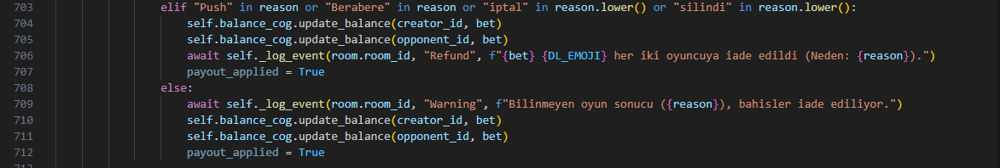

# GrowWin Bot - Oyun Adilliği ve Şeffaflık Politikası

Merhaba! Bu belge, GrowWin Discord botumuzdaki oyunların nasıl çalıştığını, şans oranlarını ve kazanç/komisyon sistemlerini şeffaf bir şekilde açıklamak için hazırlanmıştır. Amacımız, tüm kullanıcılarımıza adil, anlaşılır ve güvenilir bir oyun deneyimi sunmaktır.

**Temel Prensibimiz:** Botumuzdaki tüm şansa dayalı sonuçlar, Python'un standart `random` modülü kullanılarak, kodumuzda açıkça tanımlanmış olasılıklar veya standart oyun kuralları çerçevesinde belirlenir. Hiçbir kullanıcıya özel avantaj veya dezavantaj sağlanmaz. Mekanizmalar aşağıda açıklanmış ve ilgili kod bölümlerinin ekran görüntüleri ile desteklenmiştir.

---

## Oyun Mekanikleri, Şans Oranları ve Komisyon

### 1. Case Battle (`!cbcreate`)

Case Battle, iki oyuncunun aynı tür kasayı açarak çıkan eşyaların **toplam değerini** karşılaştırdığı bir oyundur.

*   **Adillik ve Rastgelelik (Eşya Seçimi):**
    *   Her oyuncu için kasa bağımsız olarak açılır. Bir oyuncunun sonucu diğerini etkilemez.
    *   Kasadan çıkacak eşyalar ve bu eşyaların çıkma olasılıkları (`probability`) kod içinde `StandaloneBoxOpener` sınıfındaki `boxes` sözlüğünde **sabit** olarak tanımlıdır.
        *   *Kod Referansı (Örnek Kasa Tanımı):*
            
            *Gördüğünüz gibi, her kasa için eşyalar ve onlara ait 'probability' (olasılık) ve 'price' (değer) tanımlanmıştır.*
    *   Hangi eşyanın çıkacağı, tanımlanan olasılıklara göre Python'un `random.choices` fonksiyonu ile **tamamen rastgele** seçilir.
        *   *Kod Referansı (Rastgele Seçim):*
            
            *Bu kod satırı, tanımlı olasılıklara göre listeden rastgele bir eşya seçer.*

*   **Kazananın Belirlenmesi:**
    *   Her iki oyuncunun da açtığı tüm eşyaların kodda tanımlı **değerleri** (`price`) toplanır. Toplam değeri daha yüksek olan oyuncu savaşı kazanır. Eşitlik durumunda oyun **berabere** biter.
    *   *Kod Referansı (Kazanan Karşılaştırması):*
        
        *Burada oyuncuların toplam eşya değerleri (`k_deger` ve `r_deger`) karşılaştırılarak kazanan belirlenir veya beraberlik ilan edilir.*

*   **Ödeme ve Komisyon:**
    *   Kazanan oyuncu, her iki oyuncunun açtığı eşyaların **toplam değerini** alır.
    *   Bu toplam değerden **%5 (`0.05`)** oranında **komisyon** kesilir. Komisyon, toplam eşya değerine göre hesaplanır ve yukarı yuvarlanır (`math.ceil`).
    *   *Kod Referansı (Komisyon ve Ödeme):*
        
        *Önce toplam pot (`toplam_deger`), sonra komisyon (`komisyon_miktari`) hesaplanır. Net ödül (`net_odul`) pottan komisyon çıkarılarak bulunur ve kazananın bakiyesine eklenir (`_bakiye_guncelle`).*
    *   Beraberlik durumunda, oyuncuların başlangıçta ödediği **kasa ücreti** kendilerine **tam olarak iade edilir**, komisyon alınmaz.
    *   *(Kod Referansı (İade):)*
        
        *Beraberlik durumunda `_parayi_iade_et` fonksiyonu çağrılır ve her iki oyuncuya da kasa ücreti (`iade`) geri eklenir.*

### 2. Blackjack (Multiplayer - `!bjcreate`)

Multiplayer Blackjack, iki oyuncunun birbirine karşı oynadığı ve botun sadece kuralları uygulayıp oyunu yönettiği bir moddur.

*   **Adillik ve Rastgelelik (Kart Dağıtımı):**
    *   Bot bu oyunda bir taraf **tutmaz**. Kartlar standart 52 kartlık bir desteden geliyormuş gibi Python'un `random.choice` fonksiyonu ile **rastgele** çekilir.
    *   *Kod Referansı (Kart Çekme):*
        
        *`draw_card` fonksiyonu, tanımlı `cards` listesinden rastgele bir kart seçer.*

*   **Kazananın Belirlenmesi:**
    *   Standart Blackjack kuralları geçerlidir (21'e en yakın olan veya rakibi 21'i geçen kazanır). Bust (21'i geçme) veya her iki oyuncunun durması (Stand) durumlarına göre sonuç belirlenir. Eşitlik durumunda oyun **berabere (Push)** biter.
    *   *Kod Referansı (Örnek Karar Mekanizması - Stand):*
        
        *Bu kısım, her iki oyuncu da 'Dur' dediğinde ellerin nasıl karşılaştırıldığını gösterir.*

*   **Ödeme ve Komisyon:**
    *   Kazanan oyuncu, oyuna girilen **bahis miktarının iki katını** (toplam pot) alır.
    *   Kazanan oyuncudan **%5 (`0.05`)** oranında **komisyon** kesilir. Komisyon, **orijinal bahis miktarı** üzerinden hesaplanır ve yukarı yuvarlanır (`math.ceil`).
    *   *Kod Referansı (Komisyon ve Ödeme):*
        
        *Kazanan belirlendiğinde pot (`pot`), komisyon (`commission`) hesaplanır ve net ödeme (`payout`) kazananın bakiyesine eklenir (`update_balance`).*
    *   Beraberlik (Push) durumunda bahisler oyunculara **tam olarak iade edilir**, komisyon alınmaz.
    *   *(Kod Referansı (İade):)*
        
        *Beraberlik veya diğer iade gerektiren durumlarda, bahis miktarı (`bet`) oyuncuların bakiyelerine geri eklenir.*

---

**Güveniniz Bizim İçin Önemli!**

Amacımız her zaman adil ve şeffaf bir oyun ortamı sağlamaktır. Oyun mekanizmalarımız yukarıda açıklandığı gibi çalışmaktadır ve rastgelelik için standart programlama yöntemleri kullanılmaktadır.

Herhangi bir sorunuz, öneriniz veya endişeniz olursa lütfen Discord sunucumuzdaki **`#🎫┃support`** kanalından bize ulaşmaktan çekinmeyin.

İyi eğlenceler!
